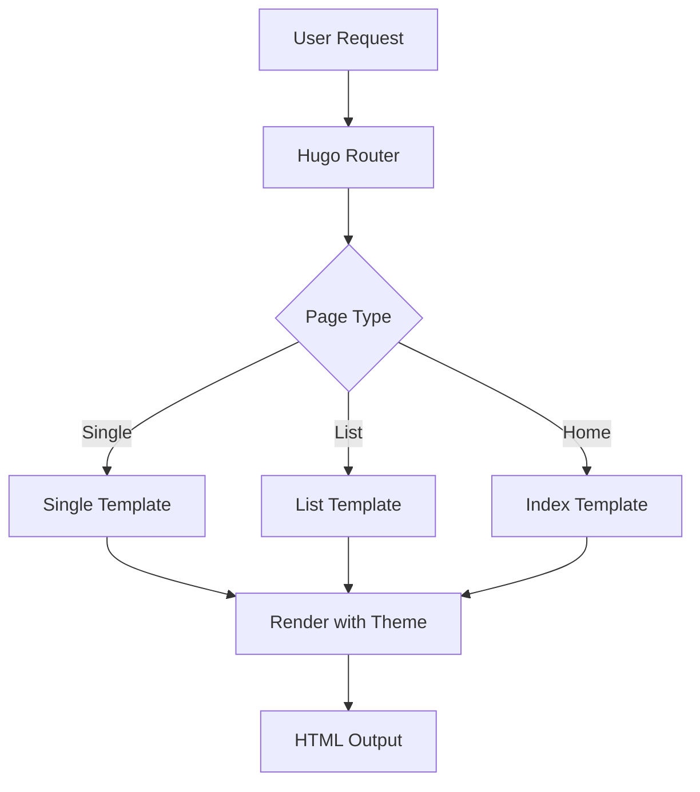

This post demonstrates how to import code from external files and display images
in the LeakIX Dark Theme.

## Importing Code from Files

The theme supports importing code directly from files, which is useful for
maintaining code examples separately from your content.

### Go Example

Here's a complete Go web server implementation imported from a file:



This server implementation shows:

- Struct definitions with JSON tags
- HTTP handler functions
- Error handling patterns
- JSON response formatting

### Python Example

And here's a Python task manager with async support:



The Python example demonstrates:

- Dataclasses and type hints
- Async/await patterns
- Enum usage
- JSON serialization

## Working with Images

The theme provides excellent support for images with automatic dark mode
optimization.

### Featured Image

 _The LeakIX Dark
Theme in action_

### Gallery Layout

<div class="image-gallery">


</div>

### Responsive Images

The theme automatically handles responsive images:

<picture>
  <source srcset="https://picsum.photos/1200/600?random=5" media="(min-width: 768px)">
  <source srcset="https://picsum.photos/600/400?random=6" media="(max-width: 767px)">
  
</picture>

## Code Comparison

Sometimes you want to show before and after code examples:

### Before Optimization

```javascript
// Inefficient code
function processData(items) {
  let results = [];
  for (let i = 0; i < items.length; i++) {
    if (items[i].active === true) {
      results.push(items[i]);
    }
  }
  return results;
}
```

### After Optimization

```javascript
// Optimized code
const processData = items => items.filter(item => item.active);
```

## Inline Code Examples

You can also include smaller code snippets inline. For example, to install the
theme:
`hugo new site mysite && cd mysite && git clone https://github.com/LeakIX/leakix-dark-theme themes/leakix-dark`.

## Architecture Diagrams



## Configuration Examples

### Theme Configuration

```toml
[params]
  # Enable code file imports
  enableCodeImports = true

  # Image optimization
  imageOptimization = true
  lazyLoadImages = true

  # Syntax highlighting theme
  syntaxTheme = "monokai"
```

## Summary

The LeakIX Dark Theme provides comprehensive support for:

- **Code imports** from external files
- **Image handling** with dark mode optimization
- **Responsive design** for all screen sizes
- **Syntax highlighting** with multiple themes
- **Mermaid diagrams** for architecture visualization

All these features work together to create a powerful platform for technical
content.
